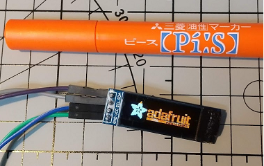
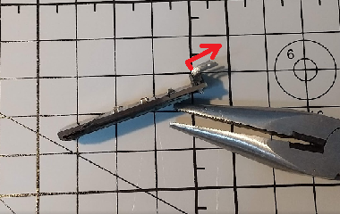
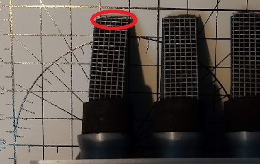
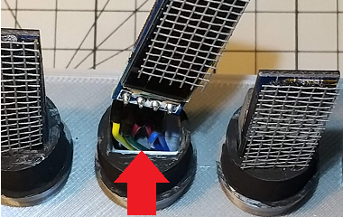
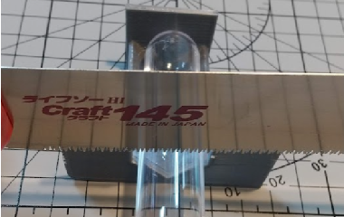
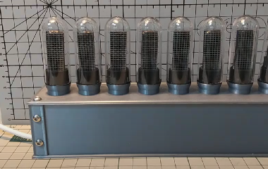

# OLIXIE

 

## Overview
* OLIXIE is a Nixie tube-style clock with 8 OLED displays.
* OLIXIE requires USB power and 2.4GHz Wifi
* OLIXIE sync internet time with ntp
* OLIXIE connects to Wifi with WPS
   * Also supports explicit SSID name
   
## Devices
* ESP-32
  * ESP32-WROOM-32 
  * Quantity: 1
  * Aideepen DOIT ESP32 DEVKIT V1 (Compatible)
    * e.g. https://amazon.co.jp/dp/B07MH58JS2/
* TCA9548A
  * I2C multiplexer breakout board for Arduino 8CH
  * Quantity: 1
  * Youmile TCA9548A (Compatible)
    * e.g. https://amazon.co.jp/dp/B084VNDMD8/
* SSD1306
  * Quantity: 8
  * WayinTop I2C SSD1306 OLED 128x32 Display (Compatible)
    * e.g. https://amazon.co.jp/dp/B085C67PF1/
* test tube
  * uxcell plastic test tube With cork stopper 20x153 mm
    * e.g. https://amazon.co.jp/dp/B09BF2LPJZ/
* screw
  * M3x8
  * Quantity: 8
    * 4 screws: for fix the top
    * 4 screws: for decoration
* screen net (optional)
  * screen door repair sheet
    * e.g. https://amazon.co.jp/dp/B01N0ZB3PK/
## Wireing

| ESP32 pin	| device | pin |
| ---- | ---- | ---- | 
| USB | USB power supply | USB |
| GND | TCA9548A | GND |
| VIN | TCA9548A | VIN |
| D21 | TCA9548A | SDA |
| D22 | TCA9548A | SCL |
  
| SSD1306(N) pin	| device | pin |
| ---- | ---- | ---- |
| GND | ESP32 | GND |
| VCC | ESP32 | VIN |
| SDA | TCA9548A | SD(N) |
| SCL | TCA9548A | SC(N) |

(N = 0 to 7, left->right)

## Housing 3D model
* See my Thingiverse site
* https://www.thingiverse.com/thing:5437130  

## How to build
1. Build housing
    * Download 3D models from my Thingiverse site
    * Build it with 3D printer
2. Customize SSD1306
    * Paint the OLED screen with an orange marker  
Do not remove the screen protection sheet and cut tab of sheet  

    * Bend the pin header with radio pliers  
bend slowly one by one  

    * Cut and paste the screen net (optional)  
Paste the black double-sided tape on the top edge of the OLED  

    * Set OLED to housing, Pass the wire through the hole in the OELD pedestal  

3. Customize test tube
    * Cut the test tube using the saw guide  
Download the saw guide from my Thingiverse site  
Turn the test tube and cut slowly and gently  

4. Write program to ESP32
    * OLIXIE.ino
    * If you are new to ESP32, please see the tutorial site
        * e.g. https://randomnerdtutorials.com/installing-the-esp32-board-in-arduino-ide-windows-instructions/
5. Wire ESP32 and TCA9548A and SSD1306
    * See Wiring explained
7. Assemble the housing
    * Pass the USB cable through the hole on the side
    * Fasten the housing top and bottom with 4 screws
    * The 4 screws on the front are decorations
    * Put the test tube on the pedestal
    * Paint the pedestal black (optional)  

## How to use
1. Turn on USB power
2. "OLIXIE" title is displayed
3. "WIFI..." is displayed
    * OLIXIE automatically connects to the last connected SSID
    * If connection is successful, "SUCCESS" is displayed and skip WPS
4. "WPS..." is displayed
    * Press the WPS button on your Wifi router
    * If connection is successful, "SUCCESS" is displayed
    * OLIXIE will restart automatically
5. The characters "NTP..." are displayed
    * Getting internet time
    * If getting is successful, "SUCCESS" is displayed
6. Time is displayed
    * Finished start up

## Tips
* Standard time
  * Default standard time is Japan
  * For countries other than Japan, set the standard time
    * OLIXIE.ino L25 `#define JST 3600*9`
* SSID 
  * When specifying the SSID explicitly, set ssid and password
  * OLIXIE.ino L18, L19 `ssid` and `password`
