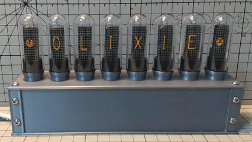

# OLIXIE

 

## Overview
* OLIXIE is a Nixie tube-style clock with 8 OLED displays.
* OLIXIE requires USB power and 2.4GHz Wifi
* OLIXIE sync internet time with ntp
* OLIXIE connects to Wifi with WPS
   * Also supports explicit SSID specification
   
## Devices
* ESP-32
  * ESP32-WROOM-32 
  * Quantity: 1
  * Aideepen DOIT ESP32 DEVKIT V1 (Compatible)
    * e.g. https://amazon.co.jp/dp/B07MH58JS2/
* TCA9548A
  * I2C multiplexer breakout board for Arduino 8CH
  * Quantity: 1
  * Youmile TCA9548A (Compatible)
    * e.g. https://amazon.co.jp/dp/B084VNDMD8/
* SSD1306
　* Quantity: 8
  * WayinTop I2C SSD1306 OLED 128x32 Display (Compatible)
    * e.g. https://amazon.co.jp/dp/B085C67PF1/
* test tube
  * uxcell plastic test tube With cork stopper 20x153 mm
    * e.g. https://amazon.co.jp/dp/B09BF2LPJZ/
* screw
  * M3x8
  * Quantity: 8
    * 4 screws: for fix the top
    * 4 screws: for decoration
* screen net (optional)
  * screen door repair sheet
    * e.g. https://amazon.co.jp/dp/B01N0ZB3PK/
## Wireing

| ESP32 pin	| device | pin |
| ---- | ---- | ---- | 
| USB | USB power supply | USB |
| GND | TCA9548A | GND |
| VIN | TCA9548A | VIN |
| D21 | TCA9548A | SDA |
| D22 | TCA9548A | SCL |
  
| SSD1306(N) pin	| device | pin |
| ---- | ---- | ---- |
| GND | ESP32 | GND |
| VCC | ESP32 | VIN |
| SDA | TCA9548A | SD(N) |
| SCL | TCA9548A | SC(N) |

(N = 0 to 7, left->right)

## housing 3D model
* See my Thingiverse site
* https://www.thingiverse.com/thing:5437130

